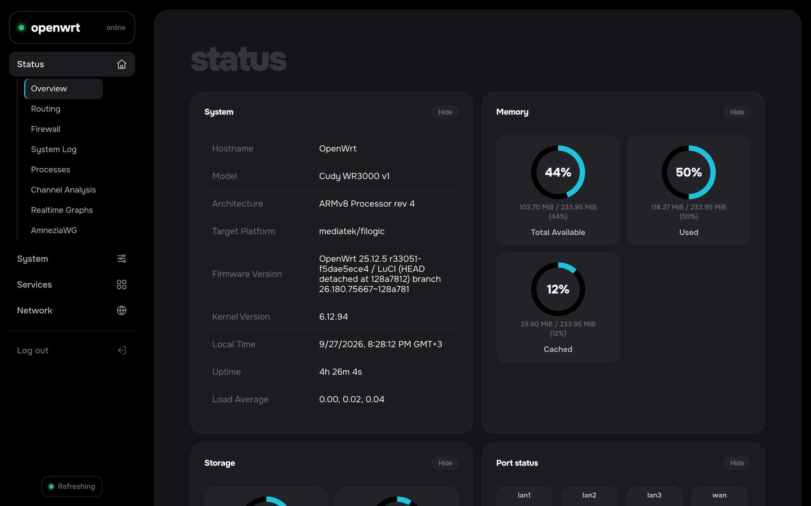
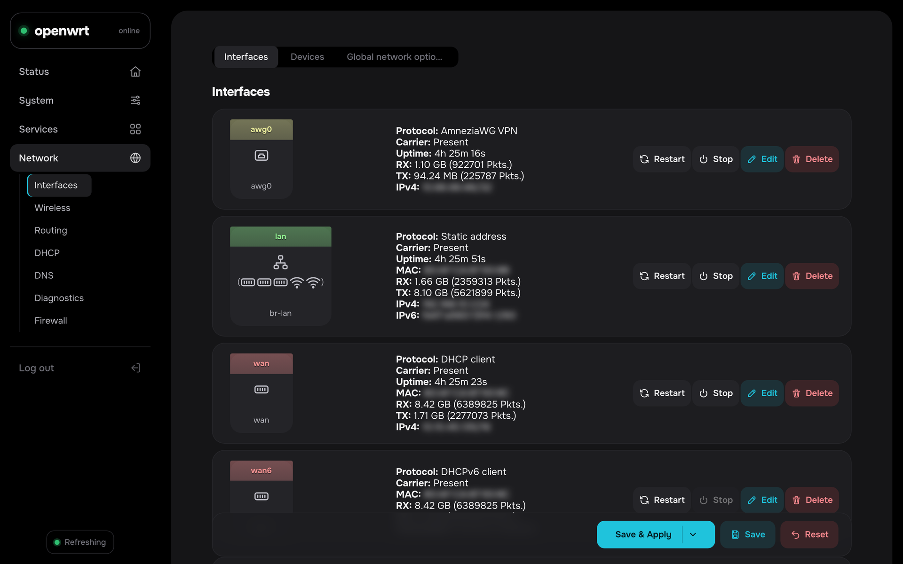
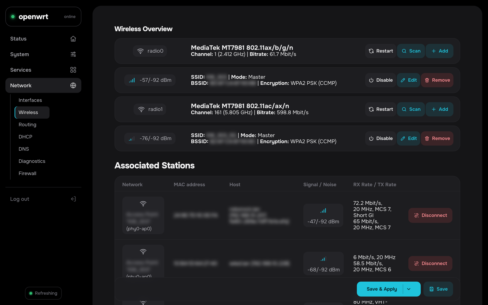
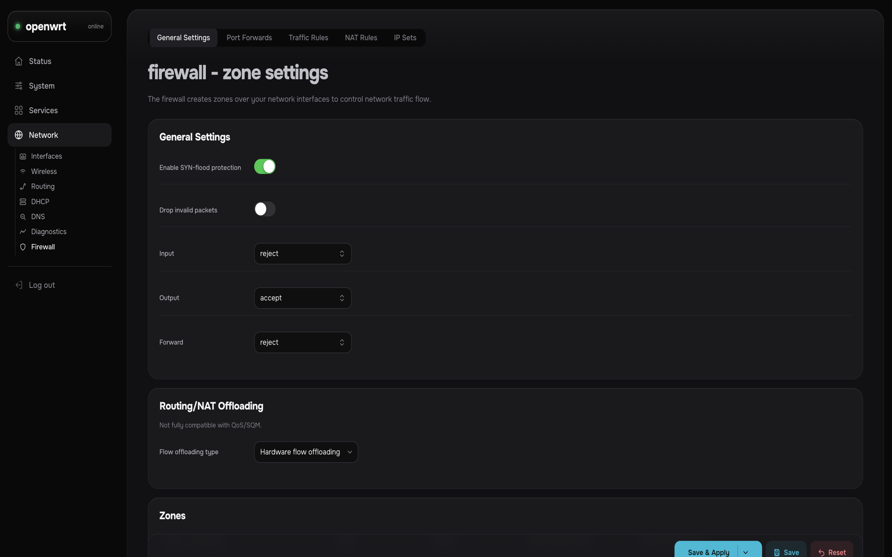
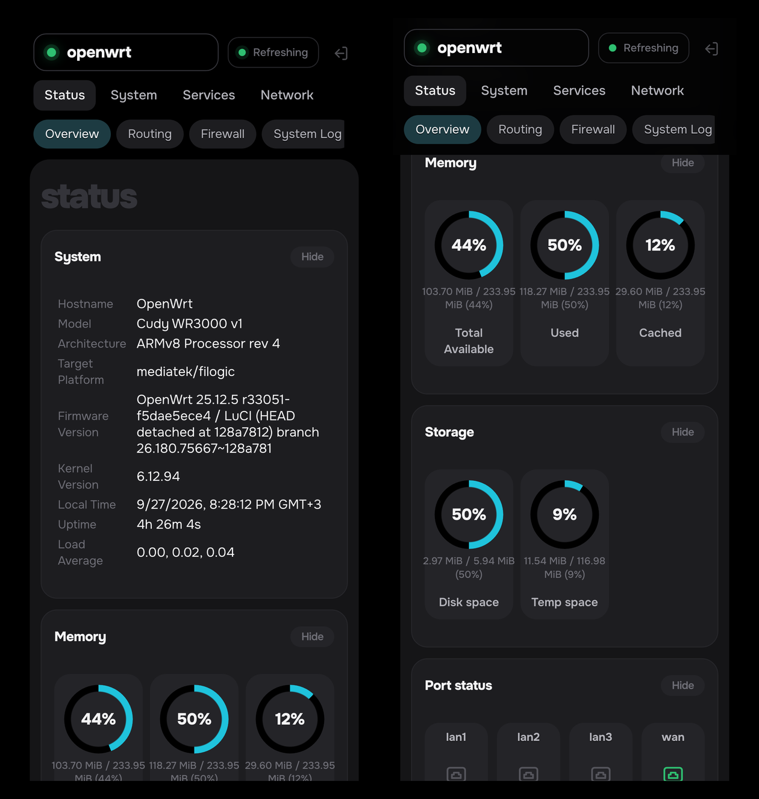

# luci-theme-graphite

A dark control-panel theme for OpenWrt LuCI. Graphite keeps LuCI's Bootstrap
markup and turns it into a modern admin panel: sidebar navigation, card layout,
ring gauges on the status page and iOS-style switches.

[RU](README_ru.md) | **EN**



<table>
<tr>
<td></td>
<td></td>
</tr>
<tr>
<td></td>
<td></td>
</tr>
</table>

## Features

- **Sidebar navigation** with line icons on sections and submenu items; the current section stays expanded, the others open as flyouts. On phones it collapses into a top bar with a scrollable row of chips.
- **Card layout**: every section is a card; Status → Overview becomes a dashboard grid, interface and Wi-Fi lists render one card per row.
- **Ring gauges** for memory, storage and connections instead of progress bars - pure CSS, no JavaScript.
- **Line icons** for interface types, Wi-Fi signal and row actions (restart, stop, edit, delete, scan…), independent of the UI language.
- **iOS-style switches** for checkboxes, rounded radios, macOS-like select pop-ups with a check mark on the selected item.
- **Bundled fonts**: Onest and JetBrains Mono (Latin + Cyrillic, ~130 KB), no requests to external CDNs.
- A quiet "live" indicator for auto-refresh; accent colour reserved for the primary action.

## Requirements

- OpenWrt 24.10 or 25.x with the ucode-based LuCI
- `luci-theme-bootstrap` (installed by default; Graphite reuses its stylesheets)
- Root SSH access

## Install

```sh
wget -qO- https://raw.githubusercontent.com/4nzor/luci-theme-graphite/main/install.sh | sh
```

The script detects the package manager (`apk` on 25.x, `opkg` on 24.x), downloads the matching
package from the latest release, installs it and switches LuCI to Graphite. Reload the page
afterwards (Ctrl+F5 / Cmd+Shift+R).

You can switch themes any time in **System → System → Language and Style**.

## Remove

```sh
wget -qO- https://raw.githubusercontent.com/4nzor/luci-theme-graphite/main/uninstall.sh | sh
```

## Try it without installing (Stylus)

`stylus/graphite.user.css` is the same design as a [Stylus](https://github.com/openstyles/stylus)
userstyle. It applies to any LuCI page (`/cgi-bin/luci`) and loads the fonts from Google Fonts.

## Build from source

```sh
cd ~/openwrt   # OpenWrt SDK or buildroot with the luci feed
git clone https://github.com/4nzor/luci-theme-graphite package/luci-theme-graphite
./scripts/feeds update luci && ./scripts/feeds install luci-base luci-theme-bootstrap
make package/luci-theme-graphite/compile V=s
```

Releases are built by GitHub Actions with the official 24.10 (`.ipk`) and 25.12 (`.apk`) SDKs.

### Editing the design

The source of truth is `stylus/graphite.user.css`. After editing it run `tools/build.sh`, which
regenerates `htdocs/luci-static/graphite/graphite.css` (Stylus wrapper removed, local
`@font-face` rules added) and stamps the version from `VERSION` into the header template.

To push a local build to a live router over SSH (defaults to `root@192.168.10.1`):

```sh
tools/deploy.sh
# or: tools/deploy.sh root@192.168.1.1
```

The script rebuilds the CSS, runs a headless nav-layout check (icon+label packed left),
uploads to `/www/luci-static/graphite/`, clears the LuCI cache, then repeats the check
against the live host. `tools/check-nav.mjs` is also gated in GitHub Actions.

## Layout

```
htdocs/luci-static/graphite/        graphite.css, fonts/
ucode/template/themes/graphite/     header.ut, footer.ut, sysauth.ut (derived from Bootstrap)
root/etc/uci-defaults/              registers and activates the theme
stylus/graphite.user.css            design source / Stylus userstyle
tools/                              build.sh, deploy.sh, fonts.css
install.sh, uninstall.sh
```

## License

Apache-2.0. Templates are derived from the LuCI Bootstrap theme (Apache-2.0). Onest and
JetBrains Mono are bundled under the SIL Open Font License 1.1. See [NOTICE](NOTICE).
