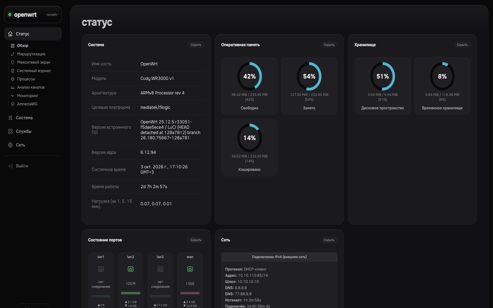
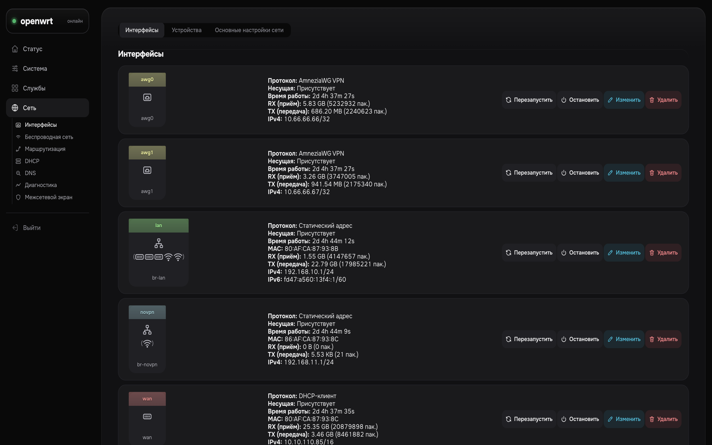
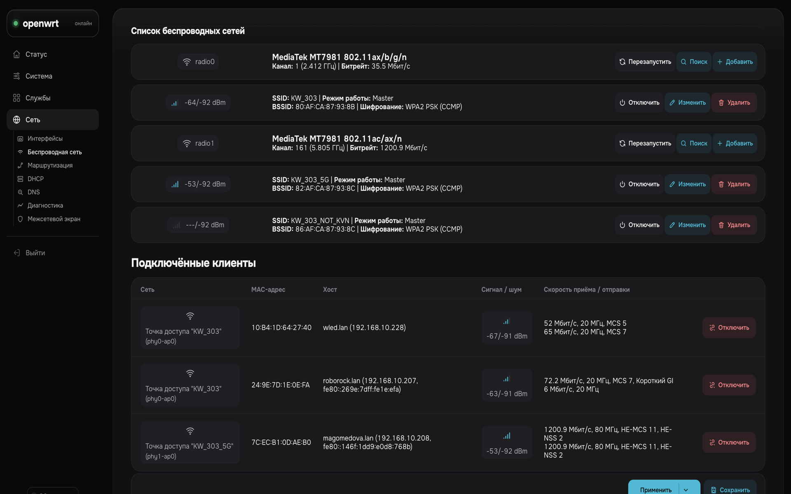
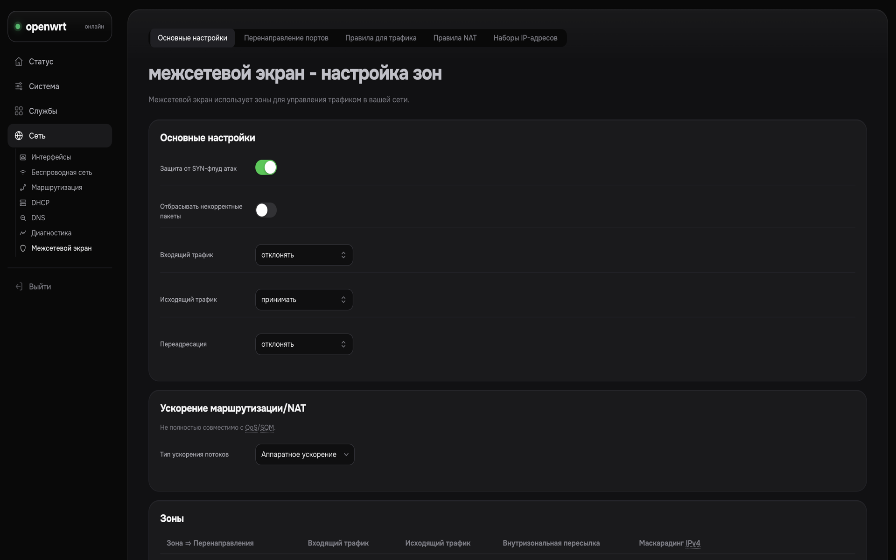
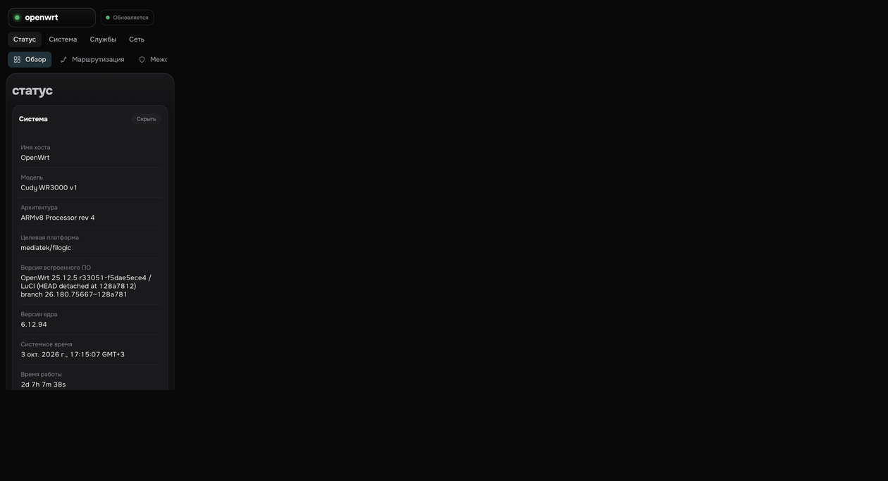

# luci-theme-graphite

Тёмная тема в стиле панели управления для OpenWrt LuCI. Graphite использует разметку
стандартной темы Bootstrap и превращает её в современную админку: боковое меню, карточки,
кольцевые диаграммы на странице статуса и переключатели в стиле iOS.

**RU** | [EN](README.md)



<table>
<tr>
<td></td>
<td></td>
</tr>
<tr>
<td></td>
<td></td>
</tr>
</table>

## Возможности

- **Боковое меню** с линейными иконками у разделов и подпунктов: текущий раздел раскрыт, остальные открываются выпадающими меню. На телефоне меню сворачивается в верхнюю панель с лентой «таблеток».
- **Карточки**: каждый раздел — отдельная карточка, «Статус → Обзор» становится дашбордом, списки интерфейсов и Wi-Fi — по карточке на строку.
- **Кольцевые диаграммы** памяти, хранилища и соединений вместо полос загрузки, на чистом CSS.
- **Линейные иконки** типов интерфейсов, уровня сигнала Wi-Fi и действий (перезапуск, остановка, изменение, удаление, поиск), независимо от языка интерфейса.
- **Переключатели в стиле iOS** вместо чекбоксов, круглые радиокнопки, выпадающие списки в стиле macOS с галочкой у выбранного пункта.
- **Шрифты в комплекте**: Onest и JetBrains Mono (латиница и кириллица, ~130 КБ), без обращений к внешним CDN.
- Спокойный индикатор автообновления; акцентный цвет только у главного действия.

## Требования

- OpenWrt 24.10 или 25.x с LuCI на ucode
- `luci-theme-bootstrap` (стоит по умолчанию, Graphite использует его стили)
- Доступ root по SSH

## Установка

```sh
wget -qO- https://raw.githubusercontent.com/4nzor/luci-theme-graphite/main/install.sh | sh
```

Скрипт сам определит менеджер пакетов (`apk` на 25.x, `opkg` на 24.x), скачает нужный пакет
из последнего релиза, установит его и включит тему. После этого обновите страницу
(Ctrl+F5 / Cmd+Shift+R).

Сменить тему можно в **Система → Система → Язык и стиль**.

## Удаление

```sh
wget -qO- https://raw.githubusercontent.com/4nzor/luci-theme-graphite/main/uninstall.sh | sh
```

## Попробовать без установки (Stylus)

`stylus/graphite.user.css` — тот же дизайн в виде пользовательского стиля для
[Stylus](https://github.com/openstyles/stylus). Применяется к любой странице LuCI
(`/cgi-bin/luci`), шрифты берёт с Google Fonts.

Если тема уже стоит на роутере — **выключи Stylus** (или синхронизируй его с этим
файлом). Старая копия в Stylus перебивает установленный CSS и ломает меню.

## Сборка из исходников

```sh
cd ~/openwrt   # SDK или buildroot OpenWrt с фидом luci
git clone https://github.com/4nzor/luci-theme-graphite package/luci-theme-graphite
./scripts/feeds update luci && ./scripts/feeds install luci-base luci-theme-bootstrap
make package/luci-theme-graphite/compile V=s
```

Релизы собирает GitHub Actions на официальных SDK 24.10 (`.ipk`) и 25.12 (`.apk`).

### Правка дизайна

Исходник — `stylus/graphite.user.css`. После правки запустите `tools/build.sh`: он пересоберёт
`htdocs/luci-static/graphite/graphite.css` (без обёртки Stylus, с локальными `@font-face`)
и пропишет версию из `VERSION` в шаблон шапки.

Чтобы сразу выложить сборку на роутер по SSH (по умолчанию `root@192.168.10.1`):

```sh
tools/deploy.sh
# или: tools/deploy.sh root@192.168.1.1
```

Скрипт соберёт CSS, прогонит headless-проверку меню (иконка и текст слева вплотную),
зальёт в `/www/luci-static/graphite/`, сбросит кэш LuCI и повторит проверку уже на
живом хосте. Тот же `tools/check-nav.mjs` крутится в GitHub Actions.

## Лицензия

Apache-2.0. Шаблоны основаны на теме LuCI Bootstrap (Apache-2.0). Шрифты Onest и
JetBrains Mono — по SIL Open Font License 1.1. Подробности в [NOTICE](NOTICE).
